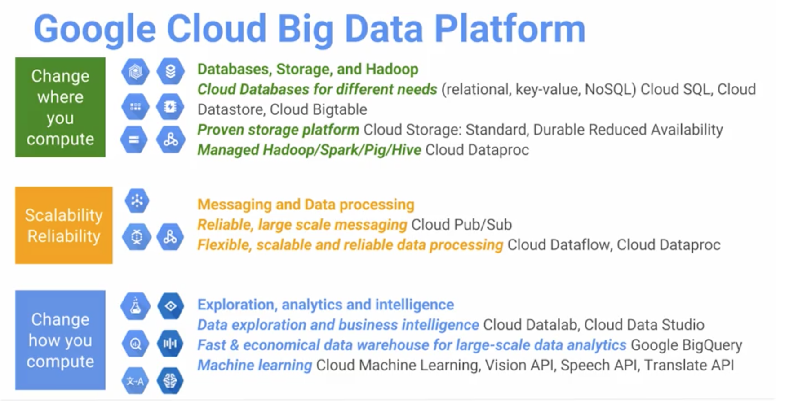

## Google Cloud Platform

### Elasticity

Don't create large clusters of machines which lie redundant - rather, use maximum processing capabilities for the minimum duration, then shut them down.

### GCP Big Data Products

No-ops - no systems operation required. You just have jobs which you submit to the cloud, Google Cloud figures out which machines to run it on.

### A functional view

- Foundation: Compute Engine, Cloud Storage.
- Databases: Cloud Datastore, Cloud SQL, Cloud Bigtable.
	- Change where you compute.
- Analytics and ML: BigQuery, Cloud Datalab, Translate API...
	- Change how you compute.
- Data handling frameworks: Cloud Pub/Sub, Cloud Dataflow, Cloud Dataproc.
	- Scalability, reliability

Example use case: [Rooms to Go](https://www.thinkwithgoogle.com/marketing-resources/data-measurement/rooms-to-go-improves-the-shopper-experience/)

- Spend less on ops / admin
- Real-time data into apps & architectures
- Apply machine learning broadly & easily
- Create citizen data scientists

### Resources

- [Datacenters](http://www.google.com/about/datacenters/)
- [Google IT Security](https://cloud.google.com/files/Google-CommonSecurity-WhitePaper-v1.4.pdf)
- [Why Google Cloud Platform?](https://cloud.google.com/why-google/)
- [Pricing Philosophy](https://cloud.google.com/pricing/philosophy)

---

## The foundations of GCP Compute and Storage

### CPUs on demand

Stop thinking about the exact machine you want, think instead about the available resources you want to have. All machines will have load balancing, advanced networking, monitoring, clustering and container-support build in.

### Preeimptible machines

Machines which give you a discounted rate in exchange for your flexibility in allowing others to use your resources as a priority if they are needed. You would do this if you are using a fault-tolerant system such as dataproc or hadoop.

A good strategy is to not bank on pre-emptible machines being available, but use them if they are free. If not, you should back off to another resource.

## Storage buckets

Given the API, can be programatically accessed with any language.
Supports edge-caching.

### Zones & regions

Problem with putting everything in one zone:

- bad for disaster recovery / service disruption.
- Distribute apps / data across zones.
- Use multiple regions to provide global access.

## Lab 2b: interact with storage

[Access the lab](https://codelabs.developers.google.com/codelabs/cpb100-cloud-storage/#0)

### Resources

- [Pricing Calculator](https://cloud.google.com/products/calculator/)
- [Pricing Principles](https://cloud.google.com/pricing/principles)

## Section 3 - Managed services for  common use cases

History: App Engine was the first Cloud Platform service provided by Google. You wrote `Java` code, uploaded it to App Engine and Google took care of all autoscaling for you.
However, people found it hard to get started on this platform.

### Stepping stones into the cloud

Google realised they needed to give people greater flexibility in how they deployed and ran their web applications.

